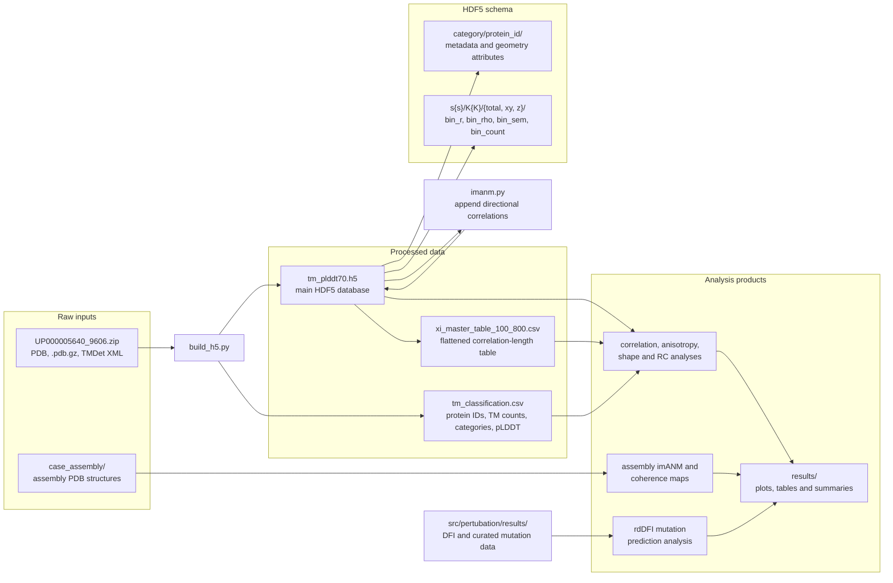

# Directional Dynamics Analysis of Membrane Proteins (imANM & rdDFI)

This repository provides the official analysis code and reproduction scripts for our paper:
**"Membrane Anisotropy Reshapes Scale-Free Correlations and Directional Mechanical Susceptibility in Transmembrane Proteins"**


To capture how membrane constraints shape directional dynamics and functional hinges, this work incorporates directional lipid stiffness into anisotropic network modeling (imANM) and introduces relative directional dynamic flexibility (rdDFI). By resolving transmembrane mechanical responses into normal and in-plane components, membrane embedding is shown to produce distinct scaling behaviors in the two directions, altering long-range correlation lengths and revealing cryptic hinge residues associated with gating and allosteric regulation. This repository provides the complete computational implementation of the framework, including the core imANM and rdDFI modules, automated workflows for proteome-wide structural analysis, and end-to-end scripts for reproducing all main figures and benchmark analyses.

---

## Core Algorithms

This repository provides a complete analysis framework for membrane-aware protein dynamics and mutation sensitivity. Its main algorithms are:

- **imANM (anisotropic elastic network model):** builds a coarse-grained C-alpha network with different membrane-plane and membrane-normal stiffness, then decomposes the resulting dynamics into in-plane (`xy`) and normal (`z`) components.
- **Directional correlation analysis:** calculates total, in-plane, and membrane-normal (`z`) correlations as a function of residue distance.
- **Correlation-length analysis:** estimates characteristic correlation lengths from distance-binned correlation curves and compares them across protein classes, lengths, mode counts (`K`), and anisotropy factors (`s`).
- **Shape and anisotropy analysis:** relates directional dynamics to protein geometry, membrane dimensions, shape descriptors, and normalized correlation length.
- **RC sensitivity analysis:** repeats imANM calculations for different contact cutoffs (`RC`) to evaluate parameter sensitivity.
- **Assembly and coherence-map analysis:** applies directional correlation analysis to complete protein assemblies and visualizes residue-residue coherence.
- **rdDFI mutation analysis:** summarizes the relative difference between membrane-normal and in-plane DFI responses at residue positions. It is used to identify directionally sensitive residues and compare them with experimentally annotated GPCR mutation sites.

The default batch imANM configuration uses a contact cutoff of `RC = 10 Å`, membrane-normal stiffness `GAMMA_Z = 1`, anisotropy factors `s = 1, 2, 4, 8, 16, 32, 64`, mode counts `K = 20, 50, 100, 200, 1000`, and a distance-bin width of `5 Å`. The RC-scan workflow overrides the contact cutoff for its designated RC values.

---

## Data Organization

The repository separates data into raw inputs, processed data, and generated analysis results.

| Layer | Main contents | Role |
|---|---|---|
| `data/raw/` | PDB, `.pdb.gz`, TMDet XML, and assembly structures | Original structural and annotation inputs |
| `data/process/` | Classification CSV, main HDF5 database, and correlation summary CSV | Reusable intermediate data for downstream analyses |
| `results/` | Figures, tables, maps, and statistical summaries | Generated analysis outputs |

### Raw Data: `data/raw/`

The raw data mainly consist of the following inputs:

1. **Human proteome structural archive:** `data/raw/UP000005640_9606.zip` contains AlphaFold-predicted PDB structures and compressed PDB files (`.pdb.gz`) for human transmembrane proteins. The archive also contains the TMDet XML annotations used for transmembrane classification.
2. **Assembly examples:** `data/raw/case_assembly/` contains the `4dkl` GPCR dimer structure and its corresponding single-chain structure, which are used for assembly imANM and coherence-map analyses.
3. **GPCR benchmark data:** `data/raw/GPCR_Mutant_Suggestion_List_Distinct_Receptors.xlsx` contains 1,452 transmembrane positions across 20 representative human non-olfactory GPCRs. These data were curated from published mutagenesis data in GPCRdb and were not generated in-house. They are used by the rdDFI evaluation workflow.

### Processed Data: `data/process/`

Processed data are intermediate and reusable data products. They avoid repeating structural classification and imANM calculations for every downstream analysis.

- **`tm_classification.csv`:** constructed directly by `src/utils/build_h5.py` from TMDet XML annotations and pLDDT values derived from PDB and `.pdb.gz` files. It contains protein identifiers, transmembrane-helix counts, protein categories, and pLDDT quality statistics. These values are used for filtering, category comparison, and quality control.
- **`tm_plddt70.h5`:** the main HDF5 database, constructed by the data-preparation and imANM workflows. It stores protein groups by category and identifier, together with residue counts, structure-quality metadata, geometric and shape descriptors, and directional imANM correlation data.
- **`xi_master_table_100_800.csv`:** a flattened summary table exported from the processed HDF5 data. It contains correlation-length measurements and associated parameters such as protein ID, category, `s`, `K`, direction, residue count, bead count, and geometry-related values. Downstream statistical scripts use this table for comparison and plotting.

The main imANM data are organized as:

```text
category/
├── protein_ids
└── protein_id/
    ├── metadata and structural attributes
    └── s{s}/
        └── K{K}/
            ├── total/
            ├── xy/
            └── z/
```

Here, `s` is the membrane anisotropy factor, `K` is the number of internal modes included in the covariance calculation, and `total`, `xy`, and `z` represent total, membrane-plane, and membrane-normal correlation data. Directional groups contain binned distance, correlation, standard-error, and count datasets where available.

### Results: `results/`

The `results/` directory contains generated products from the analysis scripts. Depending on the workflow, a run can produce correlation curves and length statistics, anisotropy comparisons, RC-scan comparisons, coherence maps, shape summaries, and rdDFI mutation-prediction statistics. These files are derived from `data/process/`, while the mutation benchmark results additionally use the curated GPCR annotation tables under `src/pertubation/results/`.

---

## Main Workflows

| Workflow | Main entry points | Main output |
|---|---|---|
| Classification and preprocessing | `src/utils/build_h5.py` | Classification CSV and base HDF5 database |
| imANM calculation | `src/imANM/imanm.py` | Directional correlation data in HDF5 |
| Correlation and anisotropy analysis | `src/imANM/analyse/` | Correlation lengths, normalized statistics, and plots |
| RC sensitivity scan | `src/rc_scan/toolkit/rc_scan.py` | RC-specific HDF5 files and comparison plots |
| Assembly and coherence analysis | `src/case_assembly/`, `src/correlation/` | Assembly correlations and coherence maps |
| GPCR rdDFI analysis | `src/pertubation/rdDFI.py`, `src/pertubation/plot.py` | Mutation-prediction statistics and figures |

The table above provides a quick overview; detailed inputs and outputs are described in the numbered workflows below.

1. **Raw-data classification and preprocessing**
    - Entry points: `src/utils/classify_tm.py`, `src/utils/add_plddt_to_csv.py`, and `src/utils/build_h5.py`.
    - Input: the raw ZIP archive containing PDB, `.pdb.gz`, and TMDet XML files.
    - Output: classification CSV files and the processed HDF5 database, optionally enriched with geometry, shape, and radius-of-gyration features.

2. **imANM calculation**
    - Entry point: `src/imANM/imanm.py`.
    - Input: `data/process/tm_plddt70.h5` and the corresponding structures in `data/raw/UP000005640_9606.zip`, or a single PDB structure in single-protein mode.
    - Output: directional correlation data written to HDF5, parameterized by `RC`, `s`, `K`, and distance bins.

3. **Correlation-length and anisotropy analysis**
    - Entry points: scripts under `src/imANM/analyse/`, including `cor_length_scan.py`, `s_scan.py`, `bin_cor_4_classifier.py`, `bin_cor_4_length.py`, and the distribution/shape analysis scripts.
    - Input: processed HDF5 data and correlation summary tables.
    - Output: correlation curves, correlation-length statistics, normalized length (`eta`) comparisons, and plots grouped by category, protein length, `s`, or `K`.

4. **RC parameter scanning**
    - Entry points: `src/rc_scan/toolkit/rc_scan.py` and `src/rc_scan/toolkit/rc_cor_length_scan.py`.
    - Input: the processed HDF5 index and structures in `data/raw/UP000005640_9606.zip`.
    - Output: one HDF5 file for each contact cutoff, such as `data/process/rc_8.h5`, `rc_10.h5`, `rc_12.h5`, and `rc_15.h5`, followed by RC-dependent correlation-length comparisons. This workflow uses `s = 16` and `K = 1000` while scanning the designated RC values.

5. **Assembly and coherence-map analysis**
    - Entry points: `src/case_assembly/extract_chain.py`, `src/case_assembly/imANM_assembly.py`, `src/case_assembly/run_coherence_map.py`, and `src/correlation/coherence_map.py`.
    - Input: complete assembly and chain structures under `data/raw/case_assembly/`.
    - Output: assembly correlation data and directional coherence maps under `results/case_assembly/` and `results/coherence_map/`.

6. **GPCR rdDFI mutation prediction**
    - Entry points: `src/pertubation/rdDFI.py` and `src/pertubation/plot.py`.
    - Input: per-residue DFI tables and curated mutation summaries under `src/pertubation/results/`.
    - Output: prediction-performance CSV files and figures comparing directional flexibility metrics with experimentally observed mutation effects.

---

## Data Structure and Flow



---

## Notes

- Run scripts from the repository root unless a script explicitly documents another working directory.
- The actual directory name is `src/pertubation/`; some older README text refers to `src/perturbation/`.
- Default data and output paths are derived from each script's location, so the repository can be run after cloning it to another directory. Command-line and function-level path overrides remain available where provided.
- `build_h5.py` creates the base database at `data/process/tm_plddt70.h5` using HDF5 write mode (`w`). Run it first to build or rebuild the database; then run `imanm.py`, which opens the same file in append mode (`a`) and writes the imANM results back into it. Do not rerun `build_h5.py` after imANM results have been written unless you intentionally want to rebuild the base database and discard those results.
- `src/rc_scan/toolkit/rc_scan.py` reads structures from `data/raw/UP000005640_9606.zip` and writes RC-specific HDF5 files under `data/process/`.
- Full imANM, assembly, and RC-scan workflows can be computationally expensive. Existing processed HDF5 and CSV files can be used for downstream analyses without repeating these calculations.

---

## How to Run

Create and activate a Python environment, then install the repository dependencies:

```bash
python3 -m venv .venv
source .venv/bin/activate
python -m pip install -r .requirement
```

Run commands from the repository root. Representative entry points are:

```bash
# Build or rebuild the base classification and HDF5 data (computationally intensive)
# Run this before imANM; it overwrites data/process/tm_plddt70.h5.
python src/utils/build_h5.py

# Append imANM correlation results to the same HDF5 (computationally intensive)
python src/imANM/imanm.py --batch

# Analyze processed correlations and anisotropy
python src/imANM/analyse/cor_length_scan.py
python src/imANM/analyse/s_scan.py

# Scan contact cutoffs (computationally intensive)
python src/rc_scan/toolkit/rc_scan.py
python src/rc_scan/toolkit/rc_cor_length_scan.py

# Analyze complete assemblies and coherence maps
python src/case_assembly/run_coherence_map.py

# Evaluate and plot GPCR rdDFI mutation sensitivity
python src/pertubation/rdDFI.py
python src/pertubation/plot.py
```

The exact command-line options and input paths can be checked at the top of each script. Preprocessing and imANM commands must be completed before downstream scripts can use newly generated HDF5 data.

---

## License

[LICENSE](LICENSE)
